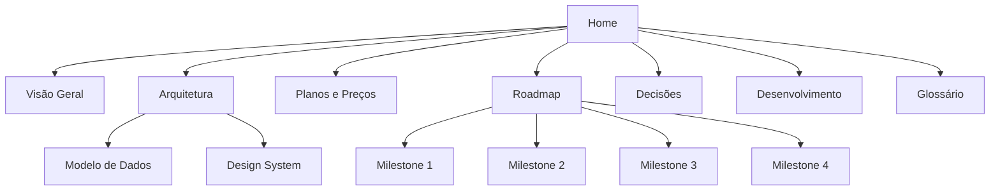

# 🚗 AutoStand — Documentação

> [!abstract] O que é
> **AutoStand** é um SaaS **whitelabel multi-tenant** que entrega site + painel de gestão para concessionárias de veículos seminovos. Cada concessionária (tenant) tem site público, painel administrativo e dados totalmente isolados.

> [!info] Estado atual
> - [[Milestone 1]] — Multi-tenancy → ✅ **concluído**
> - [[Milestone 2]] — Self-service + Billing → 🔨 **em andamento** (Fases 1 e 3–9 concluídas; falta só o pagamento)
> - [[Milestone 4]] — Distribuição & Marketplace → 🔨 **em andamento** (Fases 1–3 concluídas)
> - [[Milestone 3]] — Automação → 🔨 **em andamento** (funil de leads + WhatsApp assistido concluídos)

## 🗺️ Mapa da documentação

## 🧭 Produto
- [[Visão Geral]] — o produto, o modelo de negócio e os atores.
- [[Planos e Preços]] — os 3 tiers, capabilities e valores.
- [[Decisões]] — registro das decisões de produto e arquitetura.

## ⚙️ Técnico
- [[Arquitetura]] — stack, multi-tenancy, auth, branding, rotas.
- [[Modelo de Dados]] — as 7 tabelas do banco.
- [[Design System]] — tokens de cor/tipografia; tema da plataforma vs whitelabel.
- [[Desenvolvimento]] — como rodar, convenções e deploy.

## 🛣️ Planejamento
- [[Roadmap]] — visão geral dos milestones.
- [[Milestone 1]] · [[Milestone 2]] · [[Milestone 3]] · [[Milestone 4]]

## 📖 Referência
- [[Glossário]] — termos do projeto.
- [[Ideias]] — backlog de ideias ainda não priorizadas.

---

> [!note] Sobre este vault
> Documentação em formato Obsidian — abra a pasta `docs/` como um vault. O nome do repositório (`pedro-ivo-veiculos`) é legado do primeiro cliente e não reflete mais o escopo.
