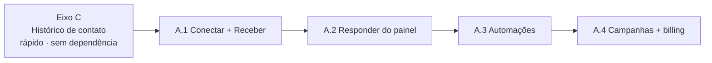

# Milestone 3 — Automação

> [!info] Status: em andamento
> O **motor de retenção**. Depois que o cliente tem site + assinatura ([[Milestone 1|M1]]–[[Milestone 2|M2]]), o que o faz **não cancelar** é a plataforma operar a venda para ele. É o que diferencia o produto de "só mais um site" — ver [[Roadmap#Posicionamento]]. O v1 (funil de leads + WhatsApp assistido) está concluído; faltam o **histórico de contato** (Eixo C) e a **automação real via WhatsApp Cloud API** (Eixo A).

## Eixo A — WhatsApp de leads

> [!success] WhatsApp assistido ✅ CONCLUÍDO
> Cada lead no funil tem **WhatsApp em 1 clique**: abre o `wa.me` do contato com uma mensagem-modelo pronta (saudação, follow-up, agendar test-drive). Enviar avança o lead de `novo` para `contatado`. Sem API, sem custo — o lojista mantém o WhatsApp dele.

## Eixo C — CRM ativo

> [!success] Funil de leads ✅ CONCLUÍDO
> `/admin/leads` deixou de ser lista plana e virou **quadro por estágio** (`novo` → `contatado` → `negociando` → `convertido` / `perdido`), com métrica de conversão e lembrete de leads novos parados sem contato. Ver [[Modelo de Dados#`leads` — CRM leve]].

---

# Plano do que falta

A ordem recomendada é **Eixo C primeiro** (rápido, sem dependência externa, já melhora o CRM e cria a base de timeline que o Eixo A vai alimentar), depois o **Eixo A em fases**.



## Eixo C — Histórico de contato (fazer primeiro)

> [!todo] Objetivo
> Registrar **interação a interação** por lead (linha do tempo de contatos) — hoje só existe o estágio atual, sem histórico.

**Modelo de dados** — nova tabela `lead_interactions`:

| Coluna | Tipo | Notas |
|---|---|---|
| `id` | pk | |
| `tenant_id` | FK → `tenants` (cascade, NOT NULL) | scoping multi-tenant ([[Arquitetura]]) |
| `lead_id` | FK → `leads` (cascade, NOT NULL) | |
| `user_id` | FK → `users` (nullable) | quem registrou; `null` = sistema/automação |
| `type` | enum (`lib/constants`) | `nota`, `whatsapp`, `ligacao`, `email`, `visita`, `mudanca_status`, `proposta` |
| `channel` | text opcional | `manual` \| `whatsapp_api` \| `sistema` |
| `body` | text | nota livre ou resumo |
| `metadata` | jsonb opcional | ex.: `{from,to}` de mudança de estágio; `wa_message_id` |
| `created_at` | timestamp | índice `(tenant_id, lead_id, created_at desc)` |

**Eventos auto-logados** (sem UI extra, instrumentando o que já existe):
- Mudança de estágio do lead → `mudanca_status` com `{from,to}`.
- Clique no WhatsApp assistido (que já avança p/ `contatado`) → `whatsapp`.
- Inbound/outbound da WhatsApp API (Eixo A) → `whatsapp` com `wa_message_id` (é o que **costura os dois eixos**).

**API & dados:**
- `GET /api/leads/[id]/interactions` (`withTenant`) — lista a timeline.
- `POST /api/leads/[id]/interactions` (`withTenant`, zod) — nota/ligação/visita manual.
- `lib/db/leads.ts`: `listLeadInteractions`, `addLeadInteraction`, e instrumentar `updateLeadStage` para logar na mesma transação.

**UI:** abrir o lead num `<Drawer>`/`<Modal>` (Camada 2 do [[Design System]]) com a timeline (ícone por tipo, autor, tempo relativo) + campo de nota rápida.

> [!tip] Gating
> Sugestão: **baseline** (todos os planos) — é CRM básico e aumenta retenção. O gate premium fica no Eixo A (automação).

**Esforço:** pequeno-médio (1 tabela, 2 endpoints, 1 drawer, instrumentar a mudança de estágio). Sem dependência externa.

## Eixo A — Automação real (WhatsApp Cloud API)

> [!todo] Objetivo
> Resposta automática pelo servidor, caixa de entrada no painel e campanhas — via **WhatsApp Business Cloud API (Meta)**.

### Decisões de arquitetura

> [!question] D1 — Cloud API direto (Meta) vs BSP
> **Cloud API direto** (modelo *Tech Provider*, via Embedded Signup) é mais barato e escala melhor, ao custo de mais setup (App Meta, verificação de negócio, gestão de templates). Um **BSP** (360dialog/Twilio/Gupshup/Z-API) acelera o MVP mas adiciona custo por mensagem e lock-in. **Recomendação:** Cloud API direto; BSP só se quiser um MVP muito rápido.

> [!question] D2 — Número por loja vs número único AutoStand
> **Número por loja** (recomendado): cada concessionária conecta o **próprio número** via Embedded Signup; AutoStand atua como *Tech Provider*. Mantém o whitelabel (o lead fala com a loja, não com a AutoStand). Cada tenant tem seu `waba_id` + `phone_number_id` + token. Número único AutoStand é mais simples mas fere o posicionamento.

> [!question] D3 — Janela de 24h
> Dentro de 24h da última mensagem do cliente: texto livre (sessão). Fora de 24h / proativo (campanhas): **só templates aprovados** (HSM) — categorias utility/marketing, com cobrança por conversa.

### Fluxo

```mermaid
sequenceDiagram
  participant Loja
  participant Painel as Painel /admin
  participant App as AutoStand (ECS)
  participant Meta as WhatsApp Cloud API
  participant Cliente

  Loja->>Painel: Conectar WhatsApp (Embedded Signup)
  Painel->>Meta: OAuth + escolha do número (WABA)
  Meta-->>App: code → troca por token (Tech Provider)
  App->>App: salva phone_number_id + token (Secrets Manager) em tenant_whatsapp
  Cliente->>Meta: mensagem para o número da loja
  Meta->>App: webhook inbound (X-Hub-Signature-256)
  App->>App: roteia por phone_number_id → tenant; casa/cria lead; loga no histórico (Eixo C)
  App-->>Painel: notifica (lead novo / nova mensagem)
  Painel->>App: responder (≤24h) ou enviar template
  App->>Meta: send message API
  Meta->>Cliente: entrega
  Meta->>App: webhook de status (delivered/read)
```

### Modelo de dados

- **`tenant_whatsapp`** (1:1 com tenant): `tenant_id`, `waba_id`, `phone_number_id`, `display_phone`, `token_ref` (referência ao **Secrets Manager**, nunca o token em texto), `status` (`pendente`/`conectado`/`erro`/`desconectado`), `connected_at`.
- **`whatsapp_messages`**: `tenant_id`, `lead_id` (nullable até casar), `wa_message_id`, `direction` (`in`/`out`), `type` (`text`/`template`/`image`…), `body`, `template_name`, `status` (`sent`/`delivered`/`read`/`failed`), `error`, `created_at`; índice `(tenant_id, lead_id, created_at)`.
- **`whatsapp_templates`** (opcional): `tenant_id`, `name`, `category`, `language`, `status` (aprovação Meta), `body` — ou gerir on-demand pela Graph API.

### Componentes

1. **Conexão (Embedded Signup):** fluxo no `/admin` para a loja autorizar; AutoStand (*Tech Provider*) troca o `code` pelo token e guarda `phone_number_id`/`waba_id` + token no **Secrets Manager** (não em texto na task def — alinhado com [[Arquitetura]] e a recomendação de segurança em [[Decisões]]). Subscribe do app ao WABA.
2. **Webhook único `POST /api/webhooks/whatsapp`:** verifica `X-Hub-Signature-256` (HMAC com o app secret — **mesmo padrão** do webhook do Mercado Pago, ver [[Milestone 2]]); `GET` para o verify-challenge. Roteia inbound por `phone_number_id` → tenant; casa por telefone com lead existente ou **cria lead** (`source: whatsapp`); grava em `whatsapp_messages` e registra a interação no **Eixo C**.
3. **Envio (`lib/whatsapp.ts`):** wrapper da Graph API — `sendText` (sessão ≤24h) e `sendTemplate` (proativo). Rate limit (reaproveita o Upstash de `lib/ratelimit.ts`) e tratamento de erro.
4. **Caixa de entrada no painel:** thread de mensagens no `/admin/leads/[id]` — responder na janela ou escolher template fora dela.
5. **Automação (regras):** auto-resposta de saudação, "fora do horário", captura de lead do inbound. Depois: **rascunho assistido por IA** (reaproveita `lib/ai.ts`/Anthropic) com **humano no loop**.
6. **Campanhas:** disparo em massa de template a um segmento (ex.: "chegou SUV novo"), respeitando opt-in, categoria marketing e os limites de qualidade da Meta.

### Fases

| Fase | Entrega | Valor |
|---|---|---|
| **A.1 — Conectar + Receber (MVP)** | Embedded Signup, webhook inbound, inbound→lead, log no histórico. *Sem envio automático ainda.* | Centraliza os leads de WhatsApp no painel |
| **A.2 — Responder do painel** | Envio em sessão (≤24h) + templates aprovados; caixa de entrada | Operar a conversa sem sair do AutoStand |
| **A.3 — Automações** | Auto-resposta, fora-do-horário, rascunho com IA (humano confirma) | Reduz tempo de resposta |
| **A.4 — Campanhas + billing** | Disparo segmentado + medição de uso/custo por conversa | Reativação e upsell |

### Custos, compliance e infra

> [!warning] Pontos de atenção
> - **Custo por conversa** (Meta cobra por categoria marketing/utility/service) — modelar como **add-on/4º tier Premium** (ver [[Planos e Preços]] e a nota de tiering abaixo) e **medir uso por tenant**.
> - **Onboarding da Meta** (verificação de negócio, aprovação de templates) é burocrático e lento — **começar cedo**.
> - **Qualidade do número:** a Meta rebaixa números com muitos bloqueios — moderar campanhas.
> - **LGPD / opt-in / opt-out (STOP)** e a regra da janela de 24h.

**Envs novos:** `META_APP_ID`, `META_APP_SECRET`, `META_WEBHOOK_VERIFY_TOKEN`; tokens por tenant no **Secrets Manager** (não na task def). O webhook público já é coberto pelo ALB ([[Arquitetura]]).

## Posição no roadmap

Vem depois do [[Milestone 2]] (billing). O **Eixo A é o candidato natural a um 4º tier / add-on Premium** — é o recurso de maior valor percebido e reforça a justificativa do plano Premium (ver [[Planos e Preços]]). O **Eixo C (histórico)** pode ser baseline, já que é CRM básico.
