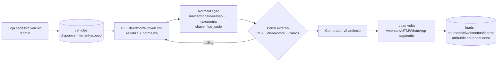

# Milestone 4 — Distribuição & Marketplace

> [!info] Status: em andamento
> Levar o estoque da concessionária **até o comprador** — não só hospedar o site dela. Gerar conteúdo de divulgação, um marketplace próprio e, no futuro, distribuir nos portais externos. Fases 1–3 concluídas.

## Decisões que orientam o milestone

Ver [[Decisões]] para o racional. Em resumo:

- **Marketplace é opt-in, em todos os planos.** A loja escolhe aparecer; no início, densidade de inventário importa mais que gating.
- **O marketplace afunila para o site whitelabel** da loja — é topo de funil, não substitui o produto que o lojista paga.
- **Marca AutoStand mantida** no marketplace v1; uma marca de consumidor própria fica para quando houver tração.
- **Sem ranking no v1** — ordenação neutra por recência; ranking de reputação exige dados que ainda não temos.
- O post de Instagram **não leva marca da plataforma** — a peça é da loja (whitelabel).

## Fases

> [!success] Fase 1 — Campos estruturados do veículo ✅ CONCLUÍDA
> `vehicles` ganhou `version`, `year_manufacture`, `body_type`, `condition`, `optionals` (JSON), `armored`, `single_owner` e `fipe_code` (migration 0003). Pré-requisito do gerador de post e dos feeds de portal — ver [[Modelo de Dados#`vehicles`]]. O formulário do `/admin` ganhou o bloco "Destaques do anúncio".

> [!success] Fase 2 — Gerador de post de Instagram ✅ CONCLUÍDA
> Recurso do plano **Pro** (capability `instagramPost`). Imagem 1080×1080 renderizada com `next/og` (`/api/veiculos/[id]/post`), vestida pela identidade da loja, **sem marca da plataforma**. Legenda gerada por IA (`/api/veiculos/[id]/legenda`, reusa `lib/ai.ts`). Slideover no `/admin` com preview, download e legenda editável.

> [!success] Fase 3 — Marketplace AutoStand v1 ✅ CONCLUÍDA
> Portal de busca cross-tenant em `autostand.com.br`: `/comprar` (busca com filtros), `/comprar/[id]` (detalhe + lead), `/lojas` e `/loja/[slug]` (diretório e perfil das concessionárias). Adesão opt-in em `/admin/marketplace`. `lib/marketplace.ts` isola a leitura cross-tenant — só leitura, só campos públicos, só lojas opt-in/ativas. Contato gera lead com `source: marketplace` na conta da loja.

> [!todo] Fase 4 — Feed para portais externos
> A concessionária cadastra o veículo **uma vez** no `/admin` e ele é publicado nos grandes portais (**OLX**, **Webmotors**, **iCarros**) sem redigitação. O mecanismo de mercado é um **feed XML por loja, por portal**: a AutoStand gera uma URL de feed, a loja a cadastra no painel de anunciante do portal, e o portal sincroniza o estoque por polling. **Depende de:** CNPJ + homologação como integradora junto a cada portal (caminho crítico); camada de normalização marca/modelo/versão → taxonomia de cada portal (o `fipe_code` já existe, `lib/schema.ts:147`). Absorve a antiga sindicância em marketplaces do [[Milestone 3]].

### Plano — Fase 4

> [!info] Princípio de arquitetura
> O feed é **distribuição tenant-scoped**, não vitrine cross-tenant. Diferente do marketplace (`lib/marketplace.ts:17-27`, a única leitura cross-tenant sancionada), cada feed contém o estoque de **uma** loja. A leitura reaproveita o padrão tenant-scoped de `lib/db/vehicles.ts` (filtra `tenant_id` + `status = 'disponivel'`), **não** `lib/marketplace.ts`. Mantém a disciplina de projeção pública: nunca expor `cost_price`; o `fipe_code` pode ser usado **internamente** para casar a taxonomia, mas não é campo de marketing.

**1. Como funciona.** Cada portal consome um arquivo de estoque por anunciante (XML, às vezes CSV) e faz polling. A loja cola a **URL do feed gerada pela AutoStand** no painel do portal. A loja continua pagando o plano de anunciante do portal — coerente com a mensalidade fixa sem comissão ([[Decisões]]).

> [!warning] Formatos divergentes — esquemas exatos UNKNOWN até a homologação
> A forma geral (1 feed XML por anunciante, polling) é estável, mas **tags, enums (combustível/câmbio/carroceria), IDs de marca/modelo/versão, limites de fotos/tamanho** vêm do manual de integração de cada portal — não inventar. Tratar cada esquema como um **serializer plugável** (`PortalSerializer`): adicionar portal = escrever 1 adapter.

**2. Geração do feed.**
- **Rota:** `GET /feed/[portal]/[token].xml` no **host da plataforma** (reusa `requirePlatformHost()`, `lib/tenant.ts`). `[token]` é opaco e **revogável** (não o `slug`), resolve `token → tenant_portal_feeds → tenant_id`.
- **Leitura:** novo `lib/db/portal-feeds.ts` (barrel `lib/db/index.ts`), tenant-scoped no padrão de `lib/db/vehicles.ts`, com fotos ordenadas por `order_idx`. Projeção que inclui `fipe_code` (uso interno) mas exclui `cost_price`.
- **Cache:** começar time-based como o sitemap (`export const revalidate`, `app/sitemap.ts:13`) com fallback gracioso a banco indisponível; evoluir para `revalidateTag(\`feed:${tenantId}\`)` em create/update/delete de veículo — crítico para tirar **carro vendido** do ar rápido.
- **Campos núcleo:** marca, modelo, **versão** (`version`), ano modelo + **fabricação** (`year`/`year_manufacture` — o Brasil anuncia `fab/mod`), `km`, `sale_price`, combustível, câmbio, cor, portas, carroceria, condição, **opcionais** (JSON), `armored`/`single_owner`, fotos (URLs absolutas HTTPS no S3/CloudFront, `lib/schema.ts:171`), e **código FIPE** quando aceito.

**3. Normalização.** O AutoStand guarda texto livre de `brand`/`model` + enums internos (`lib/constants.ts`); cada portal exige seus IDs.
- **Enums** (combustível/câmbio/carroceria): mapa estático em código, 1 arquivo por portal, no padrão catálogo de `lib/banks.ts` (`lib/portal-taxonomy/olx.ts` etc.).
- **Marca/modelo/versão:** tabela `portal_taxonomy_map`, lookup **por `fipe_code` primeiro** (chave confiável, já existe), fallback fuzzy por `(brand, model, version)`.
- **Sem match:** **omitir do feed e contar** (não publicar na categoria errada — risco de penalização); fila de revisão no `/admin`.

**4. Opt-in por portal + atribuição.** Estender `/admin/marketplace` (hoje só `marketplace_opt_in`) com um toggle por portal (grava `tenant_portal_feeds.enabled`), exibindo a URL do feed e o `external_account_id`. **Lead de volta**, por ordem de confiabilidade: (1) webhook do portal (se houver) espelhando `app/api/marketplace/lead/route.ts` com rate-limit + Turnstile; (2) URL tagueada (UTM / deep-link WhatsApp `source=olx`); (3) telefone no anúncio (manual). Novo valor de `source` por portal (estende `LEAD_SOURCES` em `lib/constants.ts`).

> [!question] UNKNOWN — entrega de lead por portal
> Vários portais **só mostram o lead no painel deles** (sem webhook). Se for o caso de OLX/Webmotors/iCarros, o caminho (1) não existe e a atribuição cai para (2)/(3). Confirmar na homologação.

**5. Dependências de negócio (caminho crítico).**
> [!danger] Bloqueadores externos — iniciar em paralelo ao desenvolvimento
> - **CNPJ** — pré-requisito para homologar como integradora.
> - **Homologação por portal** — cada um valida um arquivo de teste contra o esquema deles; alguns exigem status de parceiro/integradora. Prazos próprios.
> - **Credenciais/contratos por portal** — `external_account_id`, eventuais chaves/webhook. A **loja** mantém o próprio contrato de anunciante; a AutoStand fornece o feed.

**6. Modelo de dados** (documentar em [[Modelo de Dados]]; próxima migration é `0001_*`):

| Tabela | Campos principais | Observações |
|---|---|---|
| **`tenant_portal_feeds`** | `tenant_id` (FK cascade), `portal`, `enabled`, `token` (único), `external_account_id`, `last_generated_at`, `last_item_count`, `unmatched_count` | Unique `(tenant_id, portal)`; index por `token` |
| **`portal_taxonomy_map`** | `portal`, `fipe_code`, `autostand_brand/model`, `portal_make_id/model_id/version_id`, `confidence` | Só marca/modelo/versão; enums ficam em código |

**7. Fases.**
> [!abstract] Sequência
> - **F4.1** — feed genérico + **um** portal piloto (provável OLX); migration `tenant_portal_feeds`, rota, `lib/db/portal-feeds.ts`, interface `PortalSerializer` + 1 adapter, toggle no `/admin`, cache time-based. Homologação iniciada **em paralelo**.
> - **F4.2** — normalização (`portal_taxonomy_map` + matching por `fipe_code`; fila de "sem match").
> - **F4.3** — multi-portal (Webmotors + iCarros), atribuição de lead, dashboard de métricas, `revalidateTag` em mutações de veículo.

**8. Riscos.**
> [!failure] Riscos e mitigações
> - **Homologação lenta** (semanas–meses) — começar CNPJ + homologação antes do código pronto.
> - **Taxonomias divergentes** — `fipe_code` ajuda mas não é universal; manter `portal_taxonomy_map` + fallback fuzzy.
> - **Limites de fotos/tamanho/polling** — exatos UNKNOWN até a homologação; URLs absolutas HTTPS já temos via S3/CloudFront (`lib/schema.ts:171`).
> - **Dados stale (carro vendido ainda anunciado)** — penaliza no portal; mitigar com `revalidateTag` em mutações de estoque.
> - **Vazamento de dados internos** — manter a projeção pública (`lib/marketplace.ts:102-123`, nunca `cost_price`); `token` revogável evita feed adivinhável.

> [!todo] Fase 5 — Ranking e publicação automática
> Duas frentes **independentes** que compartilham pré-requisitos com outros milestones: (A) **ranking de lojas** no marketplace, que exige um sistema de **avaliações/reputação** — hoje a ordenação é neutra por recência (`lib/marketplace.ts:176`) e [[Decisões]] registra "sem ranking no v1 (faltam dados)"; e (B) **publicação automática** do post de Instagram via **Meta Graph API**, que reaproveita a infra de conexão Meta do [[Milestone 3]] (Embedded Signup, Tech Provider, token por tenant no Secrets Manager) e exige **app review da Meta** + conta Instagram Business por loja.

### Plano — Fase 5

> [!info] Sequenciamento
> **A é independente** (sem dependência externa) — pode ir primeiro. **B depende de app review da Meta** (lento): abrir a submissão **cedo e junto** com o [[Milestone 3]] Eixo A, pois é o **mesmo app Meta** e a **mesma verificação de negócio**.

#### A — Ranking de lojas (sistema de avaliações)

> [!abstract] Estado atual
> A busca ordena por `desc(vehicles.updated_at)` no default neutro (`lib/marketplace.ts:176-183`); o diretório `/lojas` ordena por contagem de estoque (`lib/marketplace.ts:278`). Os campos públicos da loja não têm reputação. Esta fase destrava o ranking que [[Decisões]] adiou por "faltarem dados".

**Modelo de dados** — nova tabela `reviews`:

| Coluna | Tipo | Notas |
|---|---|---|
| `tenant_id` | FK → `tenants` (cascade) | a **loja avaliada** ([[Modelo de Dados]]) |
| `lead_id` | FK → `leads` (set null) | referência do comprador (reusa o lead; sem conta de consumidor — [[Decisões]]) |
| `vehicle_id` | FK → `vehicles` (set null) | opcional |
| `rating` | int 1–5 | check constraint |
| `comment` | text (nullable) | passa por moderação |
| `reviewer_name`/`reviewer_phone` | text | desnormalizados (lead pode ser apagado); base do dedupe |
| `status` | text | `pendente`/`aprovado`/`rejeitado`/`spam` |
| `source` | text | `pos_venda`/`pos_lead`/`manual` |
| `token` | text unique | convite **single-use** (só comprador convidado avalia) |

**Agregados na `tenants`** (`rating_avg`, `rating_count`, `rating_updated_at`), recalculados na aprovação — evita join/agregação por request nas queries cross-tenant (que devem permanecer só-leitura/campos-públicos, `lib/marketplace.ts:17-27`).

**Coleta:** principal é **pós-venda** — ao criar transação `saida` (já marca o veículo `vendido`), emitir convite `token` e disparar pelo WhatsApp da loja (1-clique assistido como o Eixo A do [[Milestone 3]]); `buyer_name`/`buyer_phone` já estão na transação. Página pública `/loja/[slug]/avaliar?token=…` **sem login**. Reviews entram `pendente`; só `aprovado` conta.

**Anti-fraude:** token single-use atrelado a venda/lead real; unicidade por `(tenant_id, reviewer_phone)`; submit com rate-limit (`lib/ratelimit.ts`) + Turnstile como o lead do marketplace; loja não avalia a si mesma.

**Algoritmo de ranking** — score por loja, usado no `/lojas` e como nova ordenação "relevância" (sem mexer em `price`/`km`/`recent`, que continuam neutras):
`score = w_rep · reputação + w_fresh · recência + w_complete · completude`
- **Reputação:** **média Bayesiana** `(C·m + Σratings)/(C + n)` — loja com 2×5★ não supera uma com 50 reviews a 4,6; loja **sem** review ancora na média global, não em zero.
- **Recência:** frescor do estoque (`updated_at`). **Completude:** % de anúncios com foto/versão/opcionais/descrição.

> [!warning] Guardrails — não esconder lojas novas
> A média Bayesiana já evita punir loja nova; **boost de cold-start** nos primeiros dias; reputação entra como multiplicador **dentro de faixas de recência** (5★ nunca soterra estoque fresco — o marketplace afunila para o site whitelabel, [[Decisões]]); **cap de diversidade** por página.

> [!tip] Gating (A)
> Avaliações/ranking são **nível-marketplace, opt-in em todos os planos** ([[Planos e Preços]] / [[Decisões]]). **Sem nova capability.**

#### B — Auto-publish do Instagram (Meta Graph API)

> [!abstract] Estado atual
> O post é gerado **sob demanda e autenticado**: imagem 1080×1080 do `next/og` (`app/api/vehicles/[id]/social/post/route.tsx`, gating `instagramPost`) + legenda IA. O lojista **baixa manualmente**.

> [!info] B.0 — Sinergia com o [[Milestone 3]]
> A infra de conexão Meta é a **mesma** do Eixo A: um app Meta, Embedded Signup, Tech Provider, token por tenant no Secrets Manager, webhook assinado. O Instagram Content Publishing usa o **mesmo Facebook Login** e a **mesma verificação de negócio**; o fluxo pode pedir os escopos do WhatsApp **e** os de Instagram (`instagram_content_publish`, `pages_show_list`). **Uma** verificação + **uma** app review cobrem os dois eixos se escopados juntos.

**Modelo de dados:**
- **`tenant_instagram`** (1:1) — espelha `tenant_whatsapp`: `ig_user_id`, `fb_page_id`, `username`, `token_ref` (Secrets Manager), `status`, `opt_in`, `connected_at`. *Alternativa:* conexão unificada `tenant_meta` se WhatsApp + IG partilharem token/Business — decisão aberta.
- **`instagram_posts`** (fila + log): `tenant_id`, `vehicle_id`, `image_url` (URL pública no S3/CloudFront), `caption`, `scheduled_at`, `status` (`agendado`/`processando`/`publicado`/`falhou`/`cancelado`), `ig_creation_id`, `ig_media_id`, `error`, `attempts`; index `(status, scheduled_at)`.

**Fluxo (duas mudanças sobre o atual):**
1. **Imagem em URL pública:** a Meta busca a imagem pelos servidores dela, mas a rota atual é autenticada. Logo, **renderizar o `next/og` e persistir no S3/CloudFront** (o projeto já guarda mídia de veículo lá, `lib/schema.ts:171`), obtendo uma URL JPEG pública.
2. **Graph API em dois passos** (`lib/instagram.ts`): `POST /{ig_user_id}/media` (`image_url` + `caption`) → `creation_id`; `POST /{ig_user_id}/media_publish` (`creation_id`) → `ig_media_id`. Token do Secrets Manager via `token_ref`.

**Agendamento/rate/opt-in:** fila em `instagram_posts`; **cron** (tarefa agendada no ECS do [[Milestone 3]]) drena vencidos com retry/backoff. **Rate limit da Meta: 25 publicações/conta IG/24h** — checar via `content_publishing_limit` e throttlar por tenant (um backfill do estoque estoura). **Opt-in** por loja (`tenant_instagram.opt_in`), **separado** do marketplace, **default OFF**; manter "publicar agora" vs "agendar" vs download manual.

> [!tip] Gating (B)
> Manter na capability `instagramPost` (Pro+, `lib/plans.ts`) — o gerador já é Pro. *Alternativa:* add-on/4º tier Premium, como a discussão de tiering do WhatsApp.

**Dependências externas (B):** o **mesmo app Meta** do [[Milestone 3]] + **App Review** para `instagram_content_publish` (lento, começar cedo); cada loja precisa de conta **Instagram Business/Creator** ligada a uma Página do Facebook (atrito — muitas só têm IG pessoal); **hospedagem pública de imagem** (S3/CloudFront) acessível pela Meta; reusar `META_APP_ID`/`META_APP_SECRET`.

**Fases (B):**

| Fase | Entrega |
|---|---|
| **B.1 — Conectar IG** | Embedded Signup reusando a infra do [[Milestone 3]]; persistir token; status no `/admin` |
| **B.2 — Publicar agora** | Trigger manual → render no S3 → container → publish |
| **B.3 — Agendamento** | Fila + cron + guarda de rate limit (25/24h) + retries |
| **B.4 — (opt.) Automações** | Auto-publish ao cadastrar veículo / campanhas |

> [!warning] Riscos (B)
> - **App review / verificação** compartilhados com o [[Milestone 3]] — submeter os escopos **juntos**.
> - **Requisito de conta** (Business/Creator + Página) — atrito; guia de conversão.
> - **Teto de 25 posts/24h** — throttle obrigatório.
> - **Expiração/revogação de token** — refresh de long-lived; tratar `erro`/`desconectado` + re-auth.
> - **Whitelabel** — o post **não leva marca da plataforma** ([[Decisões]]); auto-publish sai na conta **da própria loja**.

## Relação com os outros milestones

- A **Fase 1** reaproveita e estende o `vehicles` do [[Milestone 1]].
- O **gating** (Fase 2) usa as capabilities do [[Milestone 2]] — ver [[Planos e Preços]].
- A **Fase 4** absorve o antigo Eixo B do [[Milestone 3]] (sindicância em marketplaces).

## Pendências de negócio

- CNPJ — caminho crítico para a Fase 4 (homologação de integradora).
- Definir se o marketplace ganha marca de consumidor própria quando crescer.
