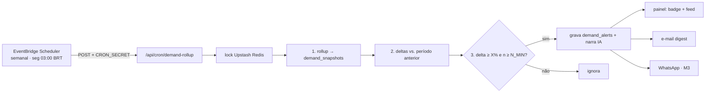

# Milestone 5 — Inteligência de Demanda

> [!info] Status: em andamento
> Transformar o comportamento de quem compra em **sinal de demanda** para a concessionária — o que o mercado procura, para a loja decidir estoque com dado em vez de achismo. Fases 1–3 concluídas.

## Decisões que orientam o milestone

Ver [[Decisões]] para o racional. Em resumo:

- **Eventos anônimos.** Registra-se só o *comportamento* (filtros usados, atributos dos veículos vistos) — nunca dado pessoal. Não é um audit-log de segurança; é analítico.
- **O agregado do marketplace é o dado único.** Uma loja sozinha só vê o próprio tráfego; a AutoStand vê a demanda de toda a rede. Esse agregado **só a plataforma tem** — é o que justifica o tier.
- **Recurso do plano Premium** (capability `marketInsights`) — mesma faixa da Análise IA.
- **Captura no servidor**, fire-and-forget — telemetria nunca derruba a navegação.

## Fases

> [!success] Fase 1 — Captura de eventos ✅ CONCLUÍDA
> Tabela `demand_events` (migration 0005). `lib/demand.ts` registra **buscas** e **visualizações** em 4 pontos: `/comprar` e o site de cada loja (buscas); `/comprar/[id]` e `/veiculos/[id]` (visualizações). `tenant_id` null = marketplace; preenchido = site da loja. Ver [[Modelo de Dados#`demand_events`]].

> [!success] Fase 2 — Painel de inteligência ✅ CONCLUÍDA
> `/admin/inteligencia` (Premium) — dois snapshots de 30 dias: **demanda no marketplace** (o mercado todo) e **demanda no site da loja**. Rankings de marcas, faixas de preço, carrocerias e cidades mais buscadas, e veículos mais vistos.

> [!success] Fase 3 — Dicas por IA ✅ CONCLUÍDA
> `gerarDicasDemanda` (`lib/ai.ts`) lê os snapshots e devolve recomendações de estoque e anúncio em linguagem natural, sob demanda. Depende de `ANTHROPIC_API_KEY` — o painel de números funciona sem a chave.

> [!todo] Futuro — tendências e alertas
> Evolução temporal (semana a semana, período vs. anterior), comparação por dimensão e **alertas proativos** ("procura por SUV subiu 30%"). Hoje a inteligência é só *point-in-time*: `getDemandSnapshot` agrega uma janela fixa de 30 dias on-the-fly (`lib/demand.ts:118`). Falta a dimensão **tempo** e o **empurrão** (a loja não precisa abrir o painel pra saber que algo mudou). Ainda não implementado.

### Plano — tendências & alertas

> [!abstract] Em uma frase
> Materializar a demanda em **snapshots por período**, derivar **deltas por dimensão** entre janelas, e quando um delta cruzar um limiar com amostra suficiente, **gerar um alerta** e entregá-lo (painel → e-mail → WhatsApp). Tudo Premium, igual ao painel atual.

#### 1. Decisão central — on-the-fly vs. snapshots materializados

Hoje o painel calcula tudo na hora: `getDemandSnapshot` roda `count(*)`/`group by` sobre `demand_events` filtrando `created_at >= since` (`lib/demand.ts:118-206`), apoiado nos índices `idx_demand_tenant_created`/`idx_demand_type_created`. Funciona para **uma** janela. Tendência exige **N janelas × várias dimensões**.

> [!success] Recomendação — híbrido
> 1. **Manter on-the-fly** para o painel "últimos 30 dias" da Fase 2 (`lib/demand.ts:118` — *live*, sempre fresco).
> 2. **Adicionar `demand_snapshots`** materializada por **semana** (e mês) para tendência, comparação e alertas: leitura O(1) por período, **histórico durável** independente da retenção dos eventos crus, deltas viram um `join` período-atual × anterior, e o job de alerta compara períodos fechados sem varrer eventos. Custo: um job de rollup + defasagem no período aberto (aceitável — tendência é semanal).

#### 2. Tendências temporais

- **Janela canônica:** semana ISO (segunda 00:00 `America/Sao_Paulo`) e mês civil; `period_start` é a chave.
- **Rollup:** ao fechar o período, agregar `demand_events` em linhas longas `(dimension, dim_key, event_type, count)` — generalizando os rankings que hoje vivem em memória (`topBrands`, `topBodyTypes`, `priceBuckets`, `topCities`, `mostViewed` em `lib/demand.ts`). Faixas de preço usam os mesmos cortes de `PRICE_BUCKETS` gravados como `dim_key`.
- **Escopo:** `tenant_id = null` (marketplace, o agregado que só a plataforma vê) e `tenant_id = X` (site da loja) — o mesmo eixo dos dois painéis.

#### 3. Comparação de períodos (deltas)

Para cada `(scope, dimension, dim_key, event_type)`: `delta_pct = round((atual − anterior) / anterior × 100)`.

> [!warning] Base pequena — suprimir % enganoso
> No beta o tráfego é baixo; 2→3 buscas é "+50%" e não significa nada. Regras (calibrar com volume):
> - **`N_MIN` = 20** eventos na janela **atual** para exibir/alertar.
> - **`N_BASE_MIN` = 10** na janela **anterior** para calcular `%` real.
> - `anterior = 0` ⇒ rotular **"novo / emergente"** (não "+∞%"), só se `atual ≥ N_MIN`.
> - Abaixo do mínimo ⇒ contagens cruas, sem `%`, com selo "amostra pequena".
> Espelha a honestidade já pedida à IA: "se um sinal for fraco, diga isso em vez de inventar tendência" (`lib/ai.ts`).

#### 4. Alertas proativos

**Regra (job):** emite alerta quando `|delta_pct| ≥ DELTA_MIN_PCT` (~25–30%) **e** `atual ≥ N_MIN` **e** `anterior ≥ N_BASE_MIN`. `severity` pela magnitude. Comparar **períodos fechados** (semana × semana) — nunca um spike de um dia.

> [!info] Geração — scheduler num deploy ECS (sem cron nativo)
> O deploy é **ECS Fargate**, não Vercel (a tabela de Stack em [[Arquitetura]] está desatualizada nesse ponto). Opções: **(A) EventBridge Scheduler → endpoint HTTPS** (`POST /api/cron/demand-rollup`) protegido por `CRON_SECRET` — **recomendada**; (B) EventBridge → ECS `RunTask`; (C) loop in-app (gambiarra). Em qualquer uma, **lock via Upstash** (`lib/ratelimit.ts`) garante idempotência.

**Entrega** (em ordem de custo):

| Canal | Como | Dependência |
|---|---|---|
| **Painel** (badge + feed) | `GET /api/inteligencia/alertas` lê `demand_alerts`; badge no nav | Nenhuma — primeira a entregar |
| **E-mail** (digest) | "Tendências da semana" para `users.email`, opt-in | **Net-new**: sem provider de e-mail hoje → sugiro **SES** (já estamos na AWS) |
| **WhatsApp** | `sendTemplate` proativo via `lib/whatsapp.ts` | **Depende do [[Milestone 3]] Eixo A** (Cloud API) |

#### 5. IA — narrar a tendência

Estender `gerarDicasDemanda` (hoje *point-in-time*) com `tendencias[]` (dimension, delta_pct, contagens, escopo); nova `narrarTendencias(trends)` em `lib/ai.ts` que devolve a frase persistida em `demand_alerts` (ex.: "procura por SUV subiu 30% essa semana — considere reforçar estoque"). Modelo `claude-haiku-4-5`; IA permanece **opcional** (números funcionam sem `ANTHROPIC_API_KEY`).

#### 6. Modelo de dados

> [!example] `demand_snapshots` (rollup materializado — ver [[Modelo de Dados]])
> `tenant_id` (nullable; `null` = marketplace), `period_type` (`week`/`month`), `period_start` (date), `dimension` (`brand`/`body_type`/`price_bucket`/`city`/`fuel`/`transmission`/`model_viewed`/`total`), `dim_key`, `event_type` (`search`/`view`), `count`. **Unique** `(tenant_id, period_type, period_start, dimension, dim_key, event_type)` → upsert idempotente; index `(tenant_id, dimension, period_start)`.

> [!example] `demand_alerts`
> `tenant_id` (nullable; `null` = alerta global do marketplace), `dimension`/`dim_key`/`event_type`, `period_type`/`period_start`, `current_count`/`previous_count`, `delta_pct`, `direction` (`up`/`down`), `severity`, `narrativa` (IA, nullable), `status` (`new`/`seen`/`dismissed`). **Unique** por chave do alerta; index `(tenant_id, status, created_at)`.

#### 7. Endpoints

- `POST /api/cron/demand-rollup` — `CRON_SECRET`, idempotente, lock Upstash. Rollup → deltas → alertas → entrega.
- `GET /api/inteligencia/tendencias?scope=&period=` — séries + deltas (Premium).
- `GET /api/inteligencia/alertas` — feed do tenant + globais (Premium); `POST .../[id]/dismiss`.
- Estender `POST /api/inteligencia` — passar `tendencias` ao `gerarDicasDemanda`.

#### 8. Gating — Premium

Tudo atrás de `capabilitiesFor(plan).marketInsights` (`lib/plans.ts`, `true` só no Premium) — o mesmo gate do painel e da rota de dicas. O job de rollup roda para todos; a **leitura** de tendências/alertas é Premium. Depende do marketplace e dos sites do [[Milestone 4]].

#### 9. Fases

> [!todo] F4 — Snapshots + job de rollup
> `demand_snapshots`, `rollupPeriod()`, `POST /api/cron/demand-rollup`, EventBridge Scheduler, **backfill** dos eventos já capturados. Base de tudo, sem UI nova.

> [!todo] F5 — Tendências no painel
> `GET /tendencias`, deltas com supressão de base pequena, gráficos semana-a-semana e período-vs-anterior.

> [!todo] F6 — Alertas proativos (in-app)
> `demand_alerts`, threshold no job, `narrarTendencias` (IA), feed + badge + dismiss.

> [!todo] F7 — Entrega externa
> E-mail (digest via SES) e/ou WhatsApp via [[Milestone 3]] Eixo A.

#### 10. Riscos

> [!danger] Pontos de atenção
> - **Bots inflando eventos** (pendência conhecida): comparar só períodos fechados, exigir variação **sustentada**, *outlier guard*, ignorar tráfego interno. Não alertar em pico de um dia.
> - **Base pequena** no início: `N_MIN`/`N_BASE_MIN`, selo "amostra pequena", priorizar o agregado do marketplace (mais volume).
> - **Sazonalidade / dia da semana**: semana-a-semana reduz; feriados ainda distorcem.
> - **Defasagem**: o período aberto não foi consolidado; o painel mistura *live* 30 dias com períodos fechados — documentar na UI.
> - **Privacidade/retenção**: snapshots permitem purgar `demand_events` crus mantendo o histórico agregado.

## Relação com os outros milestones

- A captura depende do marketplace e dos sites do [[Milestone 4]] e do [[Milestone 1]].
- O **gating** usa as capabilities do [[Milestone 2]] — ver [[Planos e Preços]].
- Reforça o plano Premium, hoje o tier mais fraco — ver [[Planos e Preços]].

## Pendências de negócio

- A inteligência só "acende" com tráfego real; no beta, o seed popula eventos sintéticos para a demo não nascer vazia.
- Filtragem de bots na captura — aceitável ignorar no v1, a revisar com volume.
