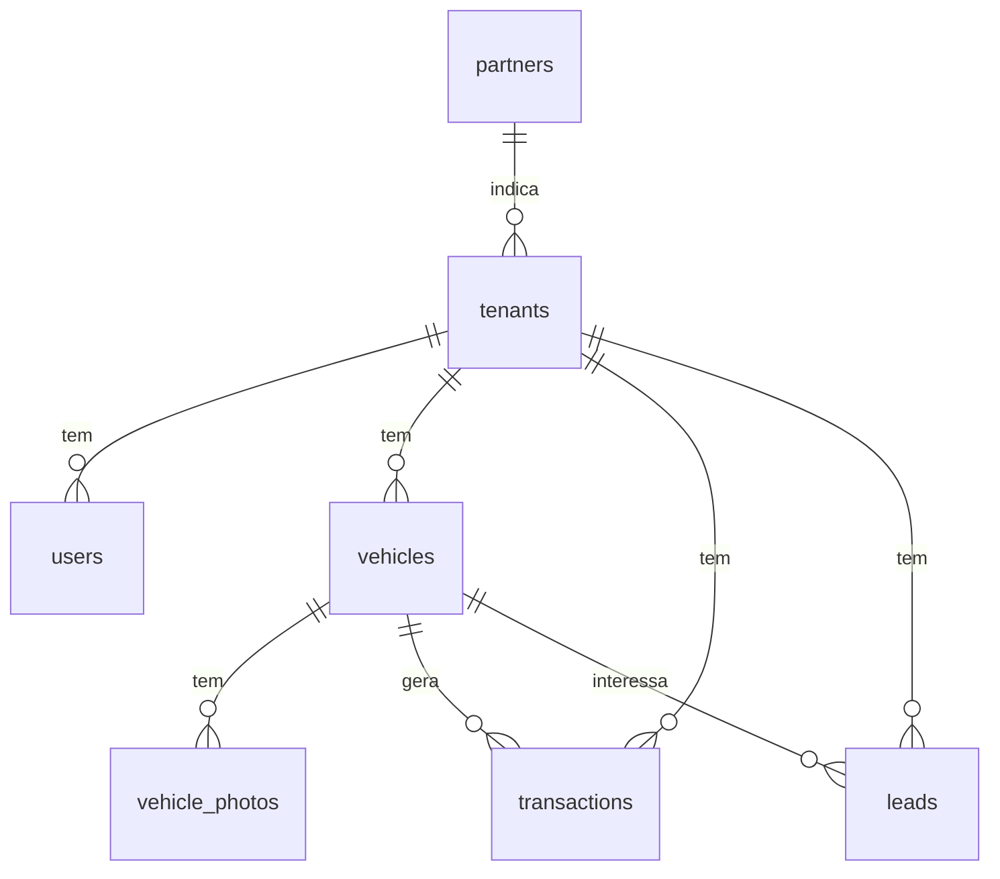

# Modelo de Dados

> [!abstract] Resumo
> 7 tabelas, definidas em `lib/schema.ts` (Drizzle). Migrations em `drizzle/`. Todas as tabelas de domínio carregam `tenant_id` — ver [[Arquitetura#Multi-tenancy]].

> [!info] Convenções
> - Nomes de propriedades em **snake_case** (casam com as colunas).
> - Valores monetários (`cost_price`, `sale_price`, `amount`) em **centavos** (inteiros).

## Diagrama

## `tenants` — concessionárias clientes

Identificação (`slug`, `name`, `custom_domain`, `status`), branding (`primary_color`, `accent_color`, `accent_dark_color`, `logo_url`, `hero_title`, `hero_subtitle`, contatos) e — desde o [[Milestone 2]] Fase 1 — **billing**:

| Campo | Uso |
|---|---|
| `plan` | `basico` / `pro` / `premium` (ver [[Planos e Preços]]). Null = tenant manual. |
| `stripe_customer_id`, `stripe_subscription_id` | Vínculo com o Stripe. |
| `subscription_status` | `incomplete` / `active` / `past_due` / `canceled`. |
| `current_period_end` | Fim do ciclo de cobrança. |
| `referred_by` | FK → `partners` (atribuição). |
| `layout_config` | JSON de customização de layout (ver `lib/layout.ts`). |
| `marketplace_opt_in` | Loja aderiu ao marketplace AutoStand — ver [[Milestone 4]]. |

## `users` — staff (sem conta de consumidor)

`tenant_id` (null para super-admin), `email` (único global), `password` (bcrypt), `name`, `role` (`super_admin` | `tenant_admin`).

## `vehicles`

`tenant_id`, `brand`, `model`, `year`, `km`, `cost_price`, `sale_price`, `transmission`, `fuel`, `color`, `doors`, `description`, `status` (`disponivel` | `reservado` | `vendido`), `primary_photo_url`.

Desde o [[Milestone 4]] Fase 1, campos estruturados para anúncios e feeds de portal: `version`, `year_manufacture`, `body_type`, `condition`, `optionals` (JSON de strings), `armored`, `single_owner`, `fipe_code`.

## `vehicle_photos`

`tenant_id`, `vehicle_id` (cascade), `url` (Vercel Blob), `order_idx`.

## `transactions`

`tenant_id`, `vehicle_id` (cascade), `type` (`entrada` | `saida`), `amount`, `date`, `buyer_name`, `buyer_phone`, `notes`.

> [!note] Efeito colateral
> Criar uma transação `saida` marca o veículo como `vendido`; `entrada` o marca como `disponivel`.

## `leads` — CRM leve

`tenant_id`, `name`, `phone`, `email`, `vehicle_id` (set null), `message`, `source` (`site` | `whatsapp` | `manual` | `marketplace`), `status` (`novo` | `contatado` | `convertido` | `perdido`).

## `partners` — links de desconto / atribuição

`name`, `code` (do link `?parceiro=`), `stripe_coupon_id`, `discount_type` (`percent` | `amount`), `discount_value`, `status`, `signup_count`. Criada na Fase 1 do [[Milestone 2]]; consumida na Fase 7.

## Camada de acesso

`lib/db.ts` exporta a instância Drizzle e todas as funções de CRUD (async). Funções de domínio recebem `tenantId` como 1º argumento; funções de plataforma (`listTenants`, `getUserByEmail`, `getPlatformStats`…) operam cross-tenant.

> [!warning] Exceção sancionada — `lib/marketplace.ts`
> O [[Milestone 4]] introduziu a **única** leitura cross-tenant de dados de domínio. `lib/marketplace.ts` lê veículos de todas as lojas com `marketplace_opt_in`. É **só leitura**, devolve **apenas campos públicos** (nunca `cost_price`, `fipe_code`) e nenhuma outra parte do código deve fazer consulta cross-tenant de dados de tenant.
