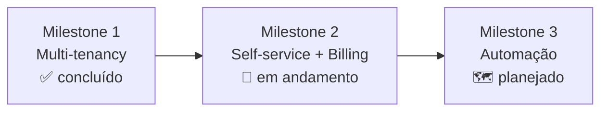

# Roadmap

> [!abstract] Resumo
> Três milestones. O [[Milestone 1]] está concluído; o [[Milestone 2]] em andamento; o [[Milestone 3]] planejado.

## Posicionamento

> [!quote] Não vendemos "um site"
> **Não somos uma plataforma de sites para concessionárias — somos a operação de venda digital da concessionária.**

O site é commodity: um cliente que compra só "um site" cancela quando ele fica pronto. O que gera **recorrência** é a automação operacional — leads no WhatsApp, distribuição em marketplaces, CRM ativo ([[Milestone 3]]).

Referência de modelo: o **Anota.ai** (SaaS de delivery) não vende "cardápio digital" — vende o robô de WhatsApp que opera o delivery. O site whitelabel é a porta de entrada (Milestones [[Milestone 1|1]]–[[Milestone 2|2]]); a automação é o motor de retenção.

> [!warning] O que NÃO se copia do Anota.ai
> PDV, robô que fecha pedido, KDS — carro usado é compra de baixíssima frequência, alto ticket e fechamento presencial. Não existe "pedido de carro". Copia-se o *modelo* de negócio, não as telas.

**Argumento de venda central:** mensalidade fixa, **sem comissão por venda** — a concessionária fica com 100% do lucro.

## Linha do tempo

## Milestones

- [[Milestone 1]] — **Multi-tenancy** ✅ — transformou o site single-tenant num SaaS whitelabel multi-tenant.
- [[Milestone 2]] — **Self-service + Billing** 🔨 — cadastro automático, Stripe, customização escalonada por plano. Fase 1 concluída.
- [[Milestone 3]] — **Automação & Distribuição** 🗺️ — o motor de retenção: WhatsApp, marketplaces, CRM ativo.

## Backlog (futuro)

- Multi-usuário por concessionária (hoje 1 `tenant_admin` por tenant).
- Automação do registro de domínio próprio via API da Vercel.
- Integração com tabela FIPE, simulador de financiamento.
