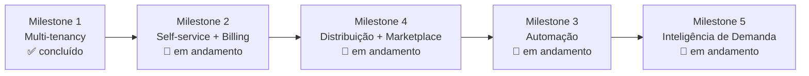

# Roadmap

> [!abstract] Resumo
> Cinco milestones. O [[Milestone 1]] está concluído; os Milestones [[Milestone 2|2]], [[Milestone 3|3]], [[Milestone 4|4]] e [[Milestone 5|5]] em andamento.

## Posicionamento

> [!quote] Não vendemos "um site"
> **Não somos uma plataforma de sites para concessionárias — somos a operação de venda digital da concessionária.**

O site é commodity: um cliente que compra só "um site" cancela quando ele fica pronto. O que gera **recorrência** é a operação de venda — distribuição em marketplaces ([[Milestone 4]]), leads no WhatsApp e CRM ativo ([[Milestone 3]]).

Referência de modelo: o **Anota.ai** (SaaS de delivery) não vende "cardápio digital" — vende o robô de WhatsApp que opera o delivery. O site whitelabel é a porta de entrada (Milestones [[Milestone 1|1]]–[[Milestone 2|2]]); a automação é o motor de retenção.

> [!warning] O que NÃO se copia do Anota.ai
> PDV, robô que fecha pedido, KDS — carro usado é compra de baixíssima frequência, alto ticket e fechamento presencial. Não existe "pedido de carro". Copia-se o *modelo* de negócio, não as telas.

**Argumento de venda central:** mensalidade fixa, **sem comissão por venda** — a concessionária fica com 100% do lucro.

## Linha do tempo

## Milestones

- [[Milestone 1]] — **Multi-tenancy** ✅ — transformou o site single-tenant num SaaS whitelabel multi-tenant.
- [[Milestone 2]] — **Self-service + Billing** 🔨 — cadastro automático, Mercado Pago, customização escalonada por plano. Falta só o pagamento.
- [[Milestone 4]] — **Distribuição & Marketplace** 🔨 — post de Instagram, marketplace multimarca AutoStand, feeds para portais. Fases 1–3 concluídas.
- [[Milestone 3]] — **Automação** 🔨 — o motor de retenção: funil de leads e WhatsApp assistido concluídos; automação via Cloud API e histórico de contato pendentes.
- [[Milestone 5]] — **Inteligência de Demanda** 🔨 — o que o mercado procura: captura anônima de buscas/visualizações, painel de demanda e dicas por IA. Fases 1–3 concluídas.

## Backlog (futuro)

- Multi-usuário por concessionária (hoje 1 `tenant_admin` por tenant).
- Automação do registro de domínio próprio (originalmente "via API da Vercel" — **defasado**, hoje é AWS; ver abaixo).
- Integração com tabela FIPE, simulador de financiamento.

## Backlog aprofundado

> [!abstract] Como ler esta seção
> Quatro ideias do backlog detalhadas como mini-specs (o que é · modelo de dados · pontos de integração · esforço · dependências). Esforço: **P** (~dias) · **M** (~1–2 semanas) · **G** (multi-fase). Itens *(a confirmar)* não foram verificados no código.

> [!warning] Correções de premissa
> - "Automação de domínio **via API da Vercel**" está **defasado**: o app roda em **AWS ECS** desde a migração (`docs/superpowers/specs/2026-06-07-infra-aws-mercadopago-design.md`). A ideia 2 reformula para AWS (ACM + ALB/CloudFront + Route 53).
> - "FIPE — migration 0003": após o port Turso→Postgres **não há migration 0003 isolada**; a coluna está em `drizzle/0000_init_postgres.sql` (tipo em `lib/schema.ts:147`).

### Multi-usuário por concessionária

**O que é.** Hoje cada tenant tem **um** `tenant_admin`, criado no cadastro (`app/api/assinar/route.ts`). O objetivo é **vários usuários por loja com papéis** (owner / admin / vendedor), permissões por papel e convite por e-mail.

> [!note] O dado já é meio-multiusuário
> `users` (`lib/schema.ts:82-92`) tem `tenant_id` e **já permite N linhas por tenant** — `listUsersByTenant` existe (`lib/db/users.ts`). Falta: (1) granularidade de papéis, (2) convite, (3) UI de equipe, (4) trocar as checagens de autorização hard-coded.

**Modelo de dados.** Expandir papéis de tenant para `owner`/`admin`/`vendedor` (migration relabela os `tenant_admin` → `owner`); nova `tenant_invitations` (`tenant_id`, `email`, `role`, `token`, `status`, `invited_by`, `expires_at`); `lib/permissions.ts` mapeando capabilities (`vehicles:write`, `finance:read`, `members:manage`) por papel — espelha `lib/plans.ts`. **Vendedor→usuário:** vincular `sellers` (sem login hoje) a `users` via `sellers.user_id` nullable, preservando a comissão por `seller_id`.

**Integração.** O JWT não muda (cada user tem 1 `tenantId`; só `role` ganha valores — `lib/auth.ts`). O gargalo é a autorização hard-coded no literal `'tenant_admin'` em `app/admin/(protected)/layout.tsx`, `app/api/vehicles/[id]/route.ts`, `app/api/vehicles/[id]/documents/route.ts`, `app/api/documents/generate/route.ts` → virar `can(role, perm)`. UI nova `app/admin/(protected)/equipe/` + rota pública de aceite.

**Esforço.** **M** (papéis + convite + refactor de autorização); **G** com unificação `sellers↔users` + matriz fina.
**Dependências.** ⚠️ **Provedor de e-mail não existe hoje** (sem resend/nodemailer/SES) — bloqueio para o convite. [[Planos e Preços]] (assentos gated?), [[Modelo de Dados]].

### Domínio próprio self-service (reformulado para AWS)

**O que é.** A loja conecta o **próprio domínio** de forma self-service. Hoje o wildcard `*.autostand.com.br` já resolve por slug ([[Milestone 2]] Fase 9, `lib/tenant.ts`), e um domínio próprio **já é roteado** se preenchido (`getTenantByDomain`, `lib/db/tenants.ts`) — **mas** o `custom_domain` é preenchido **manualmente pelo super-admin** e a dica da UI ainda diz "configure na Vercel" (`components/superadmin/TenantForm.tsx:135`, defasado). Falta emissão de cert + regra de host automatizada.

> [!info] O que a infra AWS já dá vs. o que falta
> ALB faz SSL termination preservando o Host header → ECS, com CloudFront na frente e ACM wildcard via Route 53 (cobre `*.autostand.com.br`). Cada **domínio próprio** precisa de **cert ACM próprio + regra de host** (SNI no ALB / alternate domain no CloudFront).

**Fluxo self-service:** admin informa o domínio (gated por `capabilities.customDomain`, Pro+) → app gera token → cliente cria TXT (propriedade) + CNAME/ALIAS → app faz polling de DNS → solicita cert ACM (DNS-validated) → anexa cert + regra de host → `getTenantByDomain` já roteia. **Modelo:** tabela `tenant_domains` (`domain`, `status`, `verification_token`, `acm_certificate_arn`, `verified_at`) ou colunas de status na `tenants`.

> [!warning] IAM
> Automatizar ACM/ALB/CloudFront exige **nova policy IAM** (o role de deploy hoje é mínimo ECR+ECS). Decisão de segurança — ver [[Arquitetura]].

**Esforço.** **G** (control-plane AWS + máquina de estados); um v1 **assistido** (admin submete, ops roda script) cai para **M**.

### Integração FIPE

**O que é.** Usar a FIPE como **valor de referência**: preencher valor no cadastro, exibir "preço vs FIPE" no anúncio, alimentar inteligência de preço. `vehicles.fipe_code` já existe (`lib/schema.ts:147`).

> [!warning] A FIPE não tem API REST oficial gratuita
> Consumo via API de terceiros (ex.: parallelum) ou provedor pago — **licença/rate-limit/disponibilidade a validar** *(a confirmar provedor)*. O veículo já carrega `brand/model/version/year/fuel` para casar.

**Modelo:** `fipe_reference` (mês vigente) + `fipe_prices` (cache: `fipe_code`, `model_year`, `fuel`, `price_cents`); snapshot opcional `vehicles.fipe_value_cents` no cadastro (estabiliza o "vs FIPE"). **Integração:** `VehicleForm` (botão "buscar FIPE"), página do veículo (`app/(public)/veiculos/[id]/page.tsx`) e card do marketplace (badge "X% abaixo da FIPE"). Atualização mensal por job agendado (EventBridge).
**Esforço.** **M** (cache + refresh); **P** se só lookup on-demand; **G** se espelhar o catálogo marca/modelo.

### Simulador de financiamento

**O que é.** Calculadora **client-side**: (preço, entrada, prazo, taxa) → parcela, em **Price** (fixa) e **SAC** (decrescente), na página do veículo e no marketplace. **Sem integração bancária no v1** — só simulação. Os bancos parceiros já aparecem (`lib/banks.ts`).

**Modelo:** stateless (sem tabela). Taxa default: o catálogo `BANKS` **não tem campo de taxa** hoje → começar com constante de plataforma em `lib/financing.ts` *(a confirmar taxa-base com vendas)*. **Lead opcional** "simulou financiamento": estender `leads.source` com `simulacao`. **Integração:** `lib/financing.ts` (funções puras, centavos), `components/public/FinancingSimulator.tsx` na página do veículo.
**Esforço.** **P** (matemática + UI); +P/M com captura de lead. **Dependências:** nenhuma externa. [[Glossário]] pode ganhar **Price**/**SAC**.
